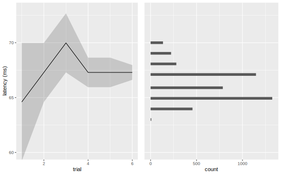

```{r setup, include=FALSE}
knitr::opts_chunk$set(echo = FALSE)
library(knitr)
library(tidyverse)
```

## Outline

- Quick intro to jsPsych
- Auditory example
- Latency example

# Hello jsPsych

## Hello JSON

JavaScript Object Notation

```{js, hello-json, fig.cap="Some JS code", echo=TRUE}
let x = {
    name: "Alistair",
    colours: ["red", "green", "blue"],
    fav_func: (arr) => arr[Date.now()%arr.length]
};

document.write(`Hello, my name is ${x.name}.`);
document.write(` My favourite colour is ${x.fav_func(x.colours)}.`);
```

## Hello World

```{js, hello-world, fig.cap="Some JS code", echo=TRUE, eval=FALSE}
const jsPsych = initJsPsych();

const hello_trial = {
    type: jsPsychHtmlKeyboardResponse,
    stimulus: 'Hello world!'
};

const goodbye_trial = {
    type: jsPsychHtmlKeyboardResponse,
    stimulus: 'Goodbye world!'
};

const timeline = [hello_trial, goodbye_trial];

jsPsych.run(timeline);
```

## Hello World Demo {.jspsych_demo_container}

```{r, echo=FALSE}
knitr::include_app("hello_world.html")
```

# Auditory Experiments

## Audio Recorder

```{js, echo=TRUE, eval=FALSE}
const rec = {
    type: PCMRecord,
    stimulus: 'Blue'
};

const play = {
    type: PCMPlay,
    pcmData: () => jsPsych.data.get().last(1).trials[0]
};

const rec_play = {
    timeline: [rec, play],
    loop_function: (data) => {
        let retry = data.values()[1].retry;
        data.values()[0].mic_signal = (retry) ? "delete" : "save";
        return data.values()[1].retry;
    }
};
```

## Audio Recorder Demo {.jspsych_demo_container}

<iframe src="audio_recorder.html"></iframe>

## Feature Comparison

```{r}
symbols <- c('\u2718', '\u2714')

  tribble(
    ~Method, ~Feature, ~jsPsych, ~`Auditory Toolbox`,
    'MediaRecorder', '', 'Y', 'N',
    'AudioWorklets', '', 'N', 'Y',
    '', 'PCM data', 'N', 'Y',
    '', 'Dedicated processing thread', 'N', 'Y',
    '', 'Sample level precision', 'N', 'Y',
    '', 'Latency measurement', 'N', 'Y'
  ) |>
  mutate_at(vars(3:4), ~if_else(.x == 'N', symbols[1], symbols[2])) |>
  kable()
```

API = Application Programming Interface<br>
PCM = Pulse-Code Modulation (uncompressed audio data)

# Latency
## Latency Test

<iframe src="latency_flow.html" style="height: 200px; border: none;"></iframe>

- Participant holds headphones up to microphone
- Left and Right channels multiplied
- Peak frequency is proportional to delay

## Latency Test Demo

```{r, echo=FALSE}
knitr::include_app("latency_test.html")
```

## Evaluation simulated

```{r, warning=FALSE}

sim_data <- readLines('sim_trials.json') |>
  jsonlite::fromJSON()

p1 <- sim_data %>%
  filter(trial_type == 'latency-test') %>%
  as_tibble() %>%
  ggplot() +
  geom_function(fun = identity, aes(dummy), lty = 2, size = 0.5, colour = 'red') +
  geom_ribbon(aes(dummy, ymin = latency - (bin_width/2), ymax = latency + (bin_width/2)), alpha = 0.2) +
  geom_line(aes(dummy, latency)) +
  labs(x = 'Simulated delay', y = 'Estimated latency')
p2 <- sim_data %>%
  filter(trial_type == 'latency-test') %>%
  as_tibble() %>%
  mutate(diff = latency - dummy) %>%
  ggplot(aes(dummy, diff)) +
  geom_point() +
  labs(x = 'Simulated delay', y = 'Error (ms)')
cowplot::plot_grid(p1, p2)
```

## Evaluation real


